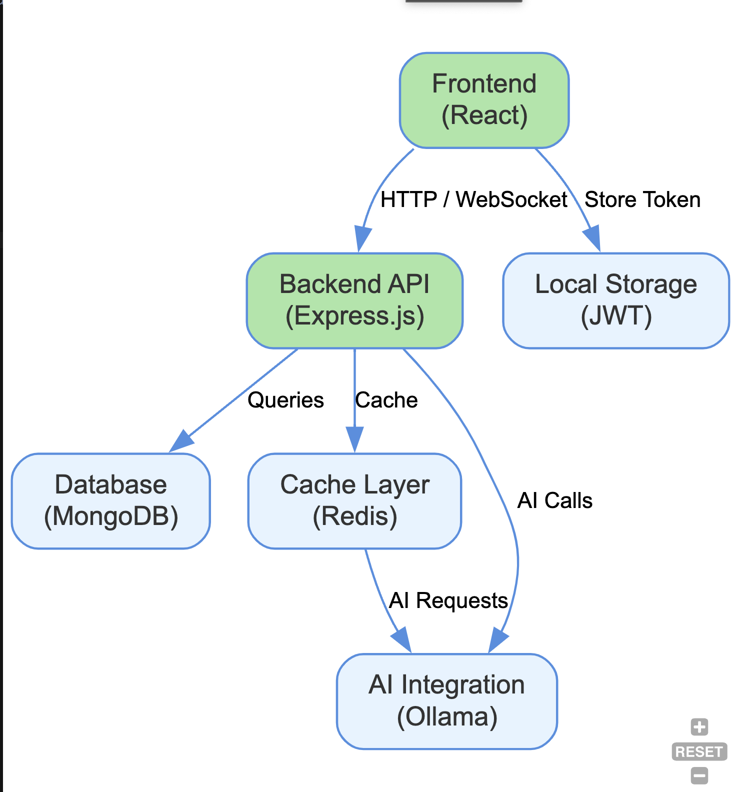

# AI Chat Platform - Architecture and Design Documentation

## Data Flow

### Authentication Flow

1. User submits login credentials (username/password)
2. Backend validates credentials against database
3. On successful validation, backend generates JWT token
4. Token is returned to frontend
5. Frontend stores token in local storage
6. For subsequent requests, token is included in Authorization header
7. Backend middleware validates token before processing protected routes

### Chat Flow

1. User selects or creates a new chat
2. Frontend establishes WebSocket connection with backend
3. User sends a message to the AI
4. Message is transmitted to backend via WebSocket
5. Backend processes message and forwards to Ollama API
6. AI response is streamed back to backend
7. Backend forwards the streaming response to frontend via WebSocket
8. Frontend renders the response in real-time
9. Chat history is saved to MongoDB

## Technical Decisions

### Why Express.js?

Express.js was chosen as the backend framework for its:
- Minimalist and unopinionated approach
- Robust middleware ecosystem
- Excellent performance characteristics
- Wide community support and documentation
- Easy integration with WebSockets and MongoDB

### Why React?

React was selected as the frontend framework for its:
- Component-based architecture for reusability
- Virtual DOM for efficient rendering
- Unidirectional data flow
- Rich ecosystem and community support
- Context API for state management
- Compatibility with modern tooling

### Why MongoDB?

MongoDB was chosen as the database for:
- Flexible schema for evolving data structures
- JSON-like document model matching the application's data
- Horizontal scalability
- Good performance for read-heavy operations
- Rich querying capabilities

### Why Socket.io?

Socket.io was selected for real-time communication because:
- It provides fallback options when WebSockets aren't available
- It has built-in support for room-based messaging
- It handles reconnection automatically
- It integrates well with Express.js
- It provides event-based programming model

### Why Redis?

Redis was implemented as a caching layer to:
- Reduce load on the Ollama API
- Improve response times for frequent queries
- Store ephemeral data like session information
- Provide pub/sub capabilities for scaling WebSockets

### Why JWT for Authentication?

JWT tokens were chosen for authentication because they:
- Enable stateless authentication
- Work well with microservices architecture
- Can contain encoded user information
- Are easily validated without database lookups
- Integrate well with modern frontend frameworks

## Security Considerations

1. **Authentication**:
   - Passwords are hashed using bcrypt
   - JWTs have appropriate expiration times
   - HTTPS is enforced in production

2. **Authorization**:
   - Route-level access control
   - User data isolation in the database
   - Resource-based permissions

3. **Data Protection**:
   - Input validation and sanitization
   - Protection against common web vulnerabilities
   - Rate limiting for API endpoints

4. **API Security**:
   - CORS configuration
   - API request validation
   - Protection against brute force attacks

## Scaling Considerations

The application is designed with scalability in mind:

1. **Horizontal Scaling**:
   - Stateless backend for easy replication
   - Redis for shared session state
   - MongoDB sharding capabilities

2. **Performance Optimization**:
   - Redis caching for frequent queries
   - Efficient database indexing
   - Client-side caching strategies

3. **Load Balancing**:
   - WebSocket connections can be balanced with sticky sessions
   - API requests can be distributed across multiple nodes

4. **Microservices**:
   - The application could be further decomposed into microservices:
     - Authentication service
     - Chat service
     - AI integration service

## Development and Deployment Workflow

1. **Local Development**:
   - Developer runs MongoDB and Redis locally or via Docker
   - Backend and frontend run on separate ports
   - Hot reloading for efficient development

2. **CI/CD**:
   - Automated testing
   - Build pipeline for frontend assets
   - Container-based deployment

3. **Production**:
   - Containerized deployment with Docker
   - Reverse proxy with Nginx
   - Process management with PM2 or similar
   - Monitoring and logging infrastructure

## Future Architectural Considerations

1. **AI Model Management**:
   - Support for multiple models and providers
   - Model versioning and rollback capabilities
   - Custom fine-tuning options

2. **Advanced Features**:
   - Multi-modal interactions (text, images, audio)
   - User preference management
   - Analytics and insights

3. **Infrastructure**:
   - Content delivery network (CDN) for static assets
   - Edge computing for lower latency
   - Database read replicas for scaling reads

4. **Internationalization**:
   - Multi-language support
   - Region-specific deployments
   - Cultural adaptations of AI responses 